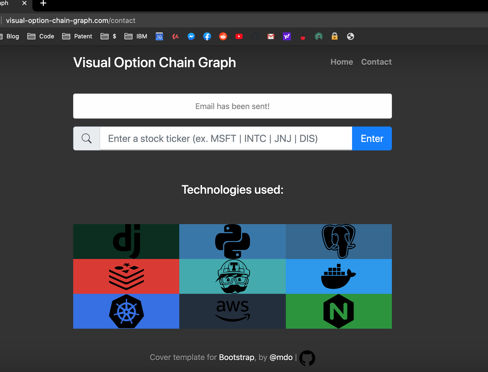
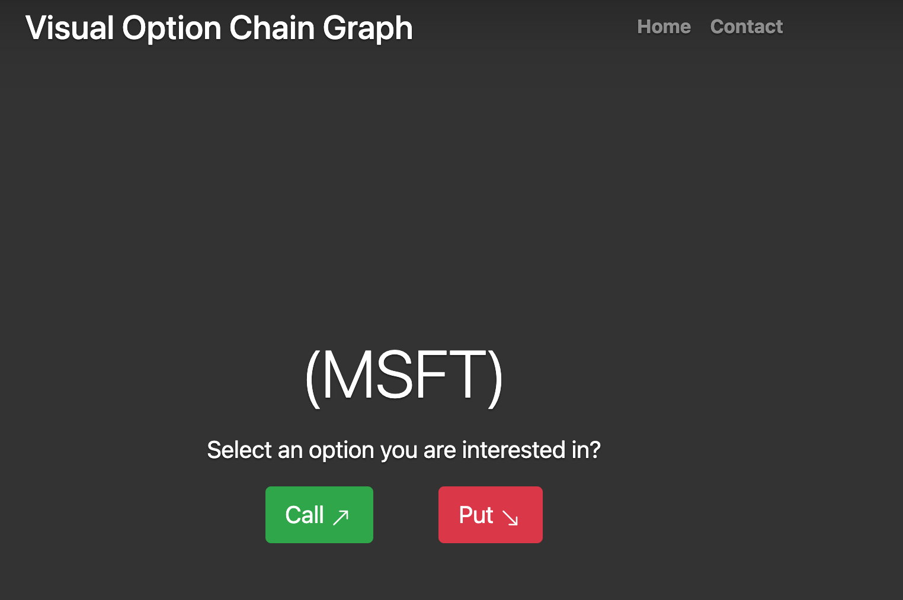
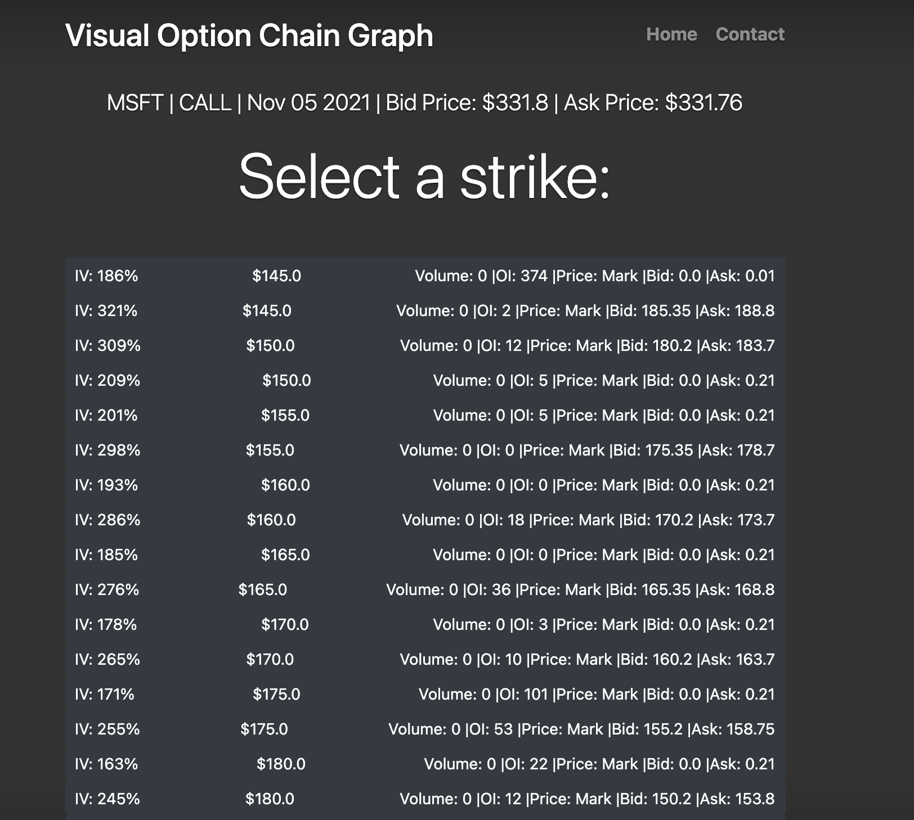
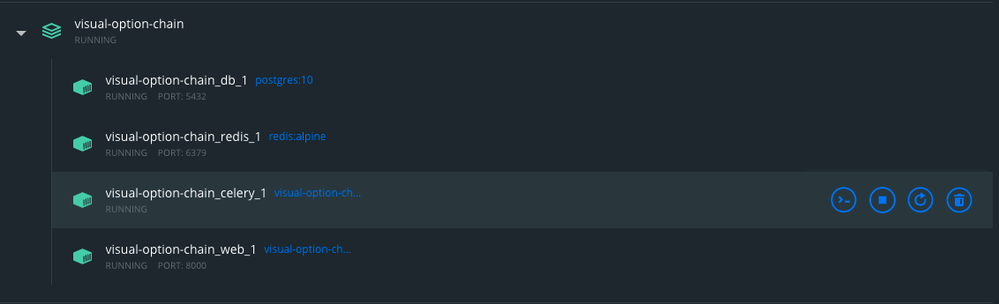
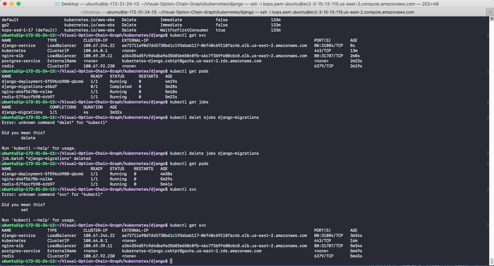
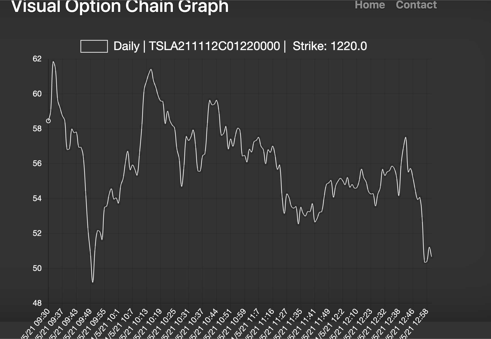

# Visual Option Chain Graph
## View the intraday prices of certain option prices from a graph persepctive

[](https://travis-ci.org/joemccann/dillinger)

Visual Option Chain Graph was a sandbox project I developed in order to learn and practice these emerging technologies from scratch. The peculiared project that I was interested in developing was a website to visually display the intraday prices of certain financial derivatives - (CALL and PUT options). 

Large & established brokerages like TD Ameritrade, Fidelity, Charles Schawbs, already have this implemented. I simply recreated the wheel for fun.

Installation and setup to get this application running is `only` in **Mac OS**. Sorry no Windows/Linux.

# Emerging Technologies learned and used:

- [Python] - Backbone of this project
- [Django] - Followed their tutorial for beginners 
- [Docker] - Read their 'Get Started' documentations 
- [Kubernetes] - Read their 'Get Started' documentations & 'Minikube' exercise
- [Travis CI] - Set up concurrent builds and travis.yml file
- [Jenkins] - Backup build
- [Celery] - Used as a seperate task to process email information in the background 
- [Nginx] - Set up for the whole world to see 
- [Redis] - Followed their interactive tutorial 
- [Amazon Web Services] - Connect all the needed technologies to make this application work reliabily
- Dillinger (the open source website) to write this README.MD
- ✨Magic ✨

## Features

- Visually see the intraday price of your call/put option on a graph
- Able to select the strike price and date from the option chain
- Quickly recieve the previous cached queries 
- Send an email/message/comment to owner of the website 

## Set up and run with Dockers

1) Clone this repository
2) Load up Dockers and at the root of the visual-option-chain directory (/Users/Will/visual-option-chain) issue inside the shell prompt
    ```sh
    $ docker-compose up 
    ```
3) Once everything is set up properly, verify on Dockers there is a running version of Celery, PostgreSQL, Redis, and of course the Web application itself. 
4) Open up a web browser and enter the url: **http://0.0.0.0:8000/** and you should be able to see the web page.
6) You are done. Play around and give it a try. Keep in mind, you won't be able to see the intraday option data anymore, since the TRADIER_API_KEY that was given to me has been expired.

Enjoy the screenshots:








## License

MIT

**Free Software, Hell Yeah!**

Keep in mind that this application will not run without an activate API key from Tradier-API (https://tradier.com/products/brokerage-api)
I would recommend you create an account with them, get the api secret key and insert it in this project and you'll be able to run this application. I guarantee it!

[//]: # (These are reference links used in the body of this note and get stripped out when the markdown processor does its job. There is no need to format nicely because it shouldn't be seen. Thanks SO - http://stackoverflow.com/questions/4823468/store-comments-in-markdown-syntax)

   [Python]: <https://www.python.org/>
   [Django]: <https://www.djangoproject.com/>
   [Docker]: <https://www.docker.com/>
   [Kubernetes]: <https://kubernetes.io/>
   [Travis CI]: <https://travis-ci.com/>
   [Jenkins]: <https://www.jenkins.io/>
   [Celery]: <https://docs.celeryproject.org/en/stable/getting-started/introduction.html>
   [Nginx]: <https://www.nginx.com/>
   [Redis]: <https://redis.io/>
   [Amazon Web Services]: <https://aws.amazon.com/>
   [venv]: <https://docs.python.org/3/tutorial/venv.html>
   [pip]: <https://pip.pypa.io/en/stable/>
 
   [PlDb]: <https://github.com/joemccann/dillinger/tree/master/plugins/dropbox/README.md>
